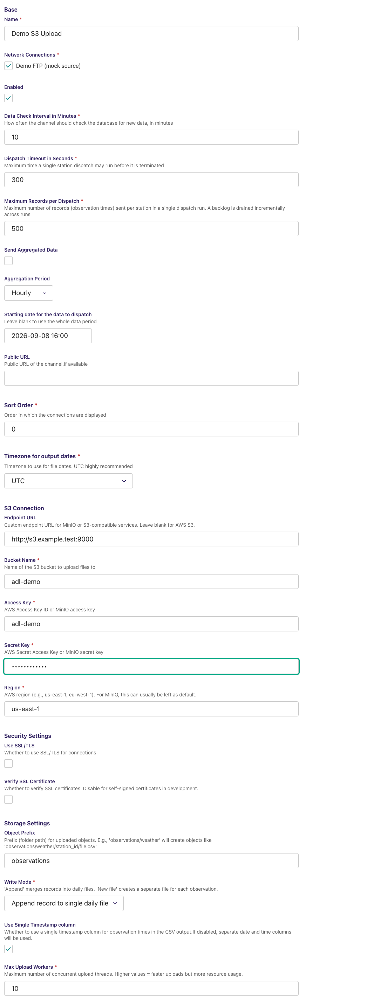
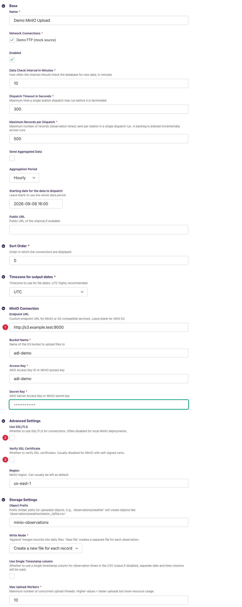
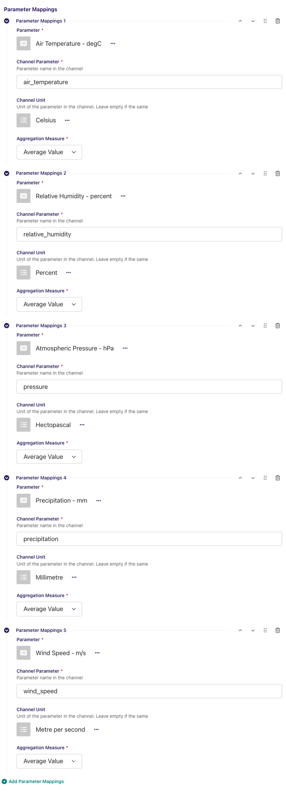
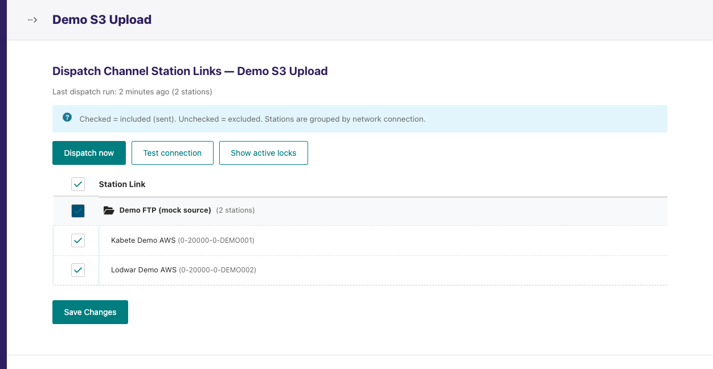

---
adl_plugin:
  name: ADL S3 Plugin
  connects_to: S3-compatible object storage (AWS S3, MinIO)
  category: general
  choose_when: You need observations pushed out as CSV objects to an S3 bucket or a MinIO server.
---
# ADL S3 Plugin

Pushes observations **out of ADL** as CSV objects into an **S3-compatible
bucket** — Amazon S3, a self-hosted MinIO, or any service speaking the S3 API
(DigitalOcean Spaces, Backblaze B2, Wasabi …). It is a *dispatch* plugin: it
collects nothing, and adds two dispatch channel types, **S3 Upload** and
**MinIO Upload**, to the *Dispatch Channels* chooser.

**Repository:** [adl-s3-plugin](https://github.com/wmo-raf/adl-s3-plugin)
**Plugin type identifier:** `adl_s3_plugin` (registry entry only — the plugin has no ingestion side)
**Dispatch channel models:** `S3Upload` · `MinIOUpload`
**Connection model / Station link model:** none — dispatch channels link to stations through the core's channel station links

> **About the screenshots.** Every image in this guide is regenerated from
> `docs/screenshots.yml` against a seeded demo instance, so bucket names,
> endpoints, station names and readings in them are placeholders — not values
> to copy. The field tables are the reference for what to enter.

## Overview

ADL's dispatch pipeline runs each enabled channel on its *data check
interval*, asks the database for the observations of every linked station
that are newer than what was last sent, and hands them to the channel. This
plugin's channels turn those records into CSV and upload them with the AWS
`boto3` client:

```
ObservationRecord ──▶ core dispatch task ──▶ S3 Upload / MinIO Upload channel
                                                     │
                                          CSV per station (per day, or per record)
                                                     │
                                                     ▼
                                   s3://<bucket>/<prefix>/<station id>/WIGOS_<station id>_<date>.csv
```

Both channel types share the same fields and the same output; **MinIO
Upload** only differs in defaults (SSL and certificate verification *off*, a
required endpoint URL) and in the order its form shows the fields. Use *S3
Upload* for AWS and for any HTTPS S3-compatible service, *MinIO Upload* for a
MinIO on your own network.

Which parameters are written, under which column name and in which unit, is
decided by the channel's **parameter mappings** — the core feature every
dispatch channel shares, documented in
[Manage Dispatch Channels](https://adl-tool.readthedocs.io/en/latest/user_guide/manage_dispatch_channels.html).
The operational actions on a channel — *Test connection*, *Dispatch now*, the
lock view — are core screens too, described in
[Dispatch Troubleshooting](https://adl-tool.readthedocs.io/en/latest/user_guide/dispatch_troubleshooting.html);
this guide covers what is specific to S3.

## Prerequisites

- A running ADL instance (see [ADL installation](https://adl-tool.readthedocs.io/en/latest/installation.html)).
- A bucket, created in advance — the plugin never creates buckets.
- An access key / secret key pair with permission to **list** the bucket
  (`s3:ListBucket`, used by *Test connection* and by the bucket check on
  every connect), **get** objects under the prefix (`s3:GetObject`, used by
  *Append* mode to read the day's existing file) and **put** objects
  (`s3:PutObject`).
- For AWS: the bucket's region. For MinIO or another service: the endpoint
  URL (`http://minio.example.org:9000`, `https://…`) reachable from the ADL
  host — allow outbound TCP to that host and port (443 for AWS).

## Installation

Installed like any ADL plugin — see [Plugin Installation](https://adl-tool.readthedocs.io/en/latest/developer_guide/plugins/plugin_installation.html)
for all methods. The `plugins.toml` entry:

```toml
[[plugins]]
name = "ADL S3 Plugin"
git  = "https://github.com/wmo-raf/adl-s3-plugin.git"
tag  = "0.0.2"
```

After rebuild/restart, confirm it appears in `docker compose exec adl
list-plugins`, and that **S3 Upload** and **MinIO Upload** are offered when
adding a dispatch channel.

## Dispatch channels provided by this plugin

In the ADL admin go to **Dispatch Channels → Add**, choose the type, and fill
in the base fields (name, network connections, enabled, data check interval,
dispatch timeout, records per dispatch, aggregation, start date) as
[Manage Dispatch Channels](https://adl-tool.readthedocs.io/en/latest/user_guide/manage_dispatch_channels.html)
describes. The plugin-specific fields follow.

### S3 Upload



| Field | Required | Default | Description |
|---|---|---|---|
| Timezone for output dates | yes | UTC | The timezone the `timestamp` (or `date`/`time`) column and the day in each file name are written in. Keep UTC unless the receiving system insists otherwise. |
| Endpoint URL | no | — | Leave **blank for AWS S3**. For any other service, the full base URL beginning `http://` or `https://` (validated on save). |
| Bucket Name | yes | — | The existing bucket. |
| Access Key | yes | — | AWS access key id, or the service's access key. |
| Secret Key | yes | — | The matching secret. Stored as entered; the form shows it in the clear. |
| Region | yes | `us-east-1` | The AWS region of the bucket (`eu-west-1` …). For non-AWS services leave the default unless the service documents one. |
| Use SSL/TLS | no | on | Whether the client connects over TLS. Only meaningful with a custom endpoint; AWS is always HTTPS. |
| Verify SSL Certificate | no | on | Turn off only for a self-signed certificate on a private service. |
| Object Prefix | no | — | Folder path prepended to every key, without leading or trailing slash, e.g. `observations/synop`. Empty writes into the bucket root. |
| Write Mode | yes | Append record to single daily file | **Append**: one object per station and day, re-read from the bucket and rewritten with the new rows merged in by timestamp. **Create a new file for each record**: one object per observation. |
| Use Single Timestamp column | no | on | On: one `timestamp` column (`YYYYMMDDTHHMMSS`). Off: separate `date` (`YYYY-MM-DD`) and `time` (`HH:MM:SS`) columns. **With *Append* mode this must be off in the current release** — see Troubleshooting. |
| Max Upload Workers | yes | 10 | Concurrent upload threads when a dispatch produces more than three files (each station's daily file is one upload, so this matters mostly for *New file* mode). Lower it on a small host, raise it for many small files. |
| Parameter Mappings | yes | — | Which ADL parameters to send, under which column name (*channel parameter*) and unit. Core feature; see the link above. |

### MinIO Upload



The same fields with MinIO defaults:

| Field | Difference from S3 Upload |
|---|---|
| Endpoint URL | **Required** — the MinIO server URL, e.g. `http://minio.example.org:9000`. Saving without one fails with `Endpoint URL is required for MinIO. E.g., http://localhost:9000 or https://minio.example.com`. |
| Use SSL/TLS | Defaults to **off**. |
| Verify SSL Certificate | Defaults to **off**. |
| Region | May be left blank; default `us-east-1`. |

### Parameter mappings

The mapping rows are the core's: for each ADL parameter to export, the
*channel parameter* is the **CSV column header** it is written under, and the
unit is what the value is converted to before writing. Column order follows
the mapping order. A record with no value for any mapped parameter is not
written at all.



## What is written to the bucket

Objects are keyed `<Object Prefix>/<station id>/<file name>`, where the
station id is the station's **WIGOS id** when it has one, otherwise its ADL
station id. With an empty prefix the leading slash is dropped and the station
folder sits at the bucket root.

| Write mode | Object | Content |
|---|---|---|
| Append | `WIGOS_<station id>_<YYYYMMDD>.csv` | Header, then one row per observation of that day (in the channel's timezone), sorted by time. Each dispatch downloads the day's object if it exists, merges the new rows in by timestamp (an existing timestamp is replaced), and uploads the whole file again. |
| New file | `WIGOS_<station id>_<YYYYMMDDTHHMMSS>.csv` | Header and a single row. Never rewritten. |

The header is `station_id,wigos_id,` then either `timestamp` or `date,time`,
then the channel parameter names in mapping order:

```csv
station_id,wigos_id,timestamp,air_temperature,relative_humidity
STN001,0-123-456-789,20240115T143000,25.5,65
```

Objects are uploaded with content type `text/csv`.

## Admin UI added by this plugin

None beyond the two channel forms. The plugin adds no page, menu entry or
button of its own. Two core-rendered surfaces show its output and are
documented here because an operator meets the plugin through them:

### Test connection

On the channel's **Station Links** page (Dispatch Channels → the channel →
*Station Links*), the **Test connection** button connects with the channel's
credentials, checks the bucket exists, lists at most one object under the
prefix and reports the result with its latency. It writes nothing.

The result appears as a message at the top of the page. It is not
screenshotted here: Wagtail shows it as a transient toast that dismisses
itself after a moment, so a captured image of it would be a picture of a
state you cannot linger on. Every result it can report is listed verbatim under
*Feedback catalogue* below — match the text on your screen to a row there.

### Dispatch status per station

The same page lists each linked station with its *last sent observation
time*, which this channel advances to the newest timestamp it uploaded. The
*Dispatch now* button runs one dispatch immediately. Both are described in
[Dispatch Troubleshooting](https://adl-tool.readthedocs.io/en/latest/user_guide/dispatch_troubleshooting.html).



## Data dispatch behavior

One dispatch, per linked station:

1. The core fetches the station's observations newer than its *last sent
   observation time* (or from the channel's start date the first time), up to
   *records per dispatch*, aggregated as the channel specifies, with the
   values converted to the mapping units.
2. The channel builds the CSV objects — one per station-day in *Append*
   mode (reading the existing object first), one per record in *New file*
   mode — skipping records with no mapped value.
3. Up to three objects are uploaded one after another; more than three are
   uploaded in parallel with *Max Upload Workers* threads.
4. The channel reports how many objects were uploaded and the newest
   observation time in the batch; the core stores that time as the station's
   watermark when at least one object was uploaded.

- **Timezones:** observation times are converted to the channel's timezone
  for the `timestamp`/`date`/`time` columns and the file-name day. The
  bucket's objects therefore roll over at midnight in that timezone.
- **Retries:** a failed upload is logged (`[S3 Dispatch] Failed: <key>: …`)
  and the dispatch continues with the next object. If *no* object uploaded,
  the watermark does not move and the records are retried next time.
- **Backfill:** set the channel's start date (core field) before linking a
  station; the core pages through history *records per dispatch* at a time.

## Source checks / diagnostics

Dispatch channels are outside the ingestion diagnostic ladder: there is no
*Ingestion Diagnostic* page or *Station Source Check* for a channel. Its
health surfaces are the **Test connection** button and the per-station
dispatch status above, and the dispatch activity logs described in
[Dispatch Troubleshooting](https://adl-tool.readthedocs.io/en/latest/user_guide/dispatch_troubleshooting.html).

### What Test connection verifies

| Check | What it verifies |
|---|---|
| Client construction and `HeadBucket` | The endpoint answers, the credentials are accepted, and the bucket exists and is visible to them. |
| `ListObjectsV2` with the prefix, one key | The credentials may list under the prefix. |

Write access is **not** tested; a missing `PutObject` permission shows up as
a failed dispatch.

### Feedback catalogue — messages this plugin produces

The *Test connection* result and the dispatch task log carry the plugin's
messages. S3 errors are rendered as `<message> (Code: <S3 code>, HTTP <n>)`.

| Message (example) | Where | Meaning | What to do |
|---|---|---|---|
| `Connection successful` | Test connection (OK) | Endpoint, credentials, bucket and list permission all fine. | — |
| `Bucket does not exist: The specified bucket does not exist (Code: NoSuchBucket, HTTP 404)` | Test connection / task log | No bucket of that name in that region or on that endpoint. | Check *Bucket Name* and *Region*; for AWS a bucket in another region answers this way. |
| `Invalid access key ID (Code: InvalidAccessKeyId, HTTP 401)` | Test connection / task log | The access key is unknown to the service. | Re-enter *Access Key*. |
| `Invalid secret access key (Code: SignatureDoesNotMatch, HTTP 401)` | Test connection / task log | The secret does not match the key. | Re-enter *Secret Key*. |
| `Access denied: Access Denied (Code: AccessDenied, HTTP 403)` | Test connection / task log | The key is valid but lacks `ListBucket` on this bucket (or `HeadBucket` is refused). | Grant `s3:ListBucket` on the bucket. |
| `Security token has expired (Code: ExpiredToken, HTTP 401)` | Test connection | Temporary credentials were entered and have lapsed. | Use a long-lived key pair. |
| `Invalid bucket name: … (Code: InvalidBucketName, HTTP 400)` | Test connection | The name breaks S3 naming rules. | Use the bucket's exact name. |
| `Could not connect to the endpoint URL: "http://minio:9000/…" (HTTP 500)` | Test connection / task log | The endpoint host or port is unreachable from the ADL host. | Check *Endpoint URL*, DNS and the firewall; for MinIO, that the port is the API port (9000), not the console. |
| `SSL validation failed for https://… (HTTP 500)` | Test connection | The endpoint's certificate is not trusted. | Install the CA on the ADL host, or turn *Verify SSL Certificate* off for a private service. |
| `Unexpected error: …` | Test connection | A failure outside the S3 client, e.g. a malformed endpoint URL. | Read the message; check *Endpoint URL* begins with `http://` or `https://`. |
| `Failed to upload 'obs/0-123-456-789/WIGOS_0-123-456-789_20240115.csv': Access denied: … (Code: AccessDenied, HTTP 403)` | task log (error) | Listing works but writing is refused. | Grant `s3:PutObject` under the prefix. |
| `[S3 Dispatch] Uploaded 3 files to <channel> (failed: 1)` | task log (info) | Summary of one dispatch. A non-zero *failed* has a `Failed:` line above it. | Look at the preceding error. |
| `[S3 Dispatch] No files to upload` | task log (info) | Every record in the batch was empty for the mapped parameters, or in *Append* mode nothing was newer than the day's object. | Normal when stations are quiet; otherwise check the parameter mappings. |
| `[S3 Prepare] Skipped 12 records with no valid values` | task log (info) | Records with none of the mapped parameters set were dropped. | Normal for partial observations. |
| `Endpoint URL must start with http:// or https://` | channel form | Validation on save. | Fix the URL. |
| `Endpoint URL is required for MinIO. E.g., http://localhost:9000 or https://minio.example.com` | MinIO channel form | Validation on save. | Enter the MinIO API URL. |

## Troubleshooting

**Dispatch works once per day, then fails with `KeyError: 'date'` until the next day**
: *Append* mode with *Use Single Timestamp column* **on** (the default). The
  channel writes the day's object with a `timestamp` column, but when it
  reads that object back to merge new rows it expects `date` and `time`
  columns, so every dispatch after the first of the day raises and no rows
  are added. Turn *Use Single Timestamp column* **off** on any *Append*
  channel, or use *New file* mode. Delete the day's object afterwards so it
  is rewritten with the new header.

  This is a defect in 0.0.2, not a configuration you got wrong — the two
  settings it needs are both defaults. A fix is in flight
  ([wmo-raf/adl-s3-plugin#6](https://github.com/wmo-raf/adl-s3-plugin/pull/6));
  once it is released, *Append* works with either timestamp setting and the
  workaround above is no longer needed.

**Test connection succeeds but dispatches fail with Access denied**
: The key can list but not write. Grant `s3:PutObject` (and `s3:GetObject`
  for *Append* mode) on `arn:aws:s3:::<bucket>/<prefix>/*`.

**Objects land in the wrong folder or at the root**
: *Object Prefix* is empty or has a trailing slash. Enter it as
  `folder/subfolder` with no slashes at either end.

**Times in the CSV are off by the local offset**
: *Timezone for output dates* is not what the receiving system expects.
  Both columns and file-name days follow it.

**Some records never reach the bucket after a partial failure**
: If one object of a dispatch uploads and another fails, the core still
  moves the station's watermark to the newest timestamp of the whole batch,
  so the failed object's records are not retried. Fix the cause, then use
  the core's station link reset (Dispatch Troubleshooting) to re-send from
  an earlier time.

**MinIO refuses the connection with a TLS error**
: *Use SSL/TLS* is on but the endpoint is `http://`, or the MinIO
  certificate is self-signed with *Verify SSL Certificate* on. Match the
  scheme, or turn verification off.

## Compatibility

| Plugin version | Requires ADL core | Notes |
|---|---|---|
| 0.0.2 | 0.8.x (dispatch channel `test_connection` contract) | Current release. `boto3` and `pandas` are installed with the plugin. Known defect: *Append* mode is incompatible with the default *Use Single Timestamp column* setting (see Troubleshooting). |

## Changelog

See [GitHub Releases](https://github.com/wmo-raf/adl-s3-plugin/releases).
